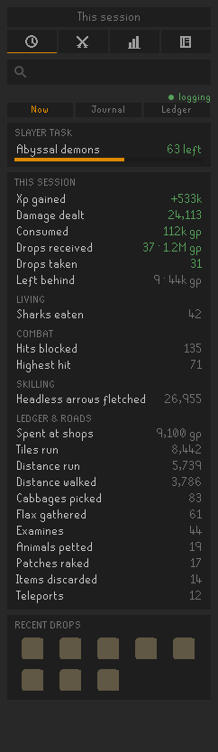
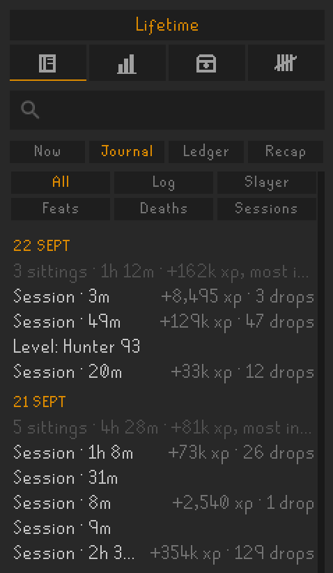
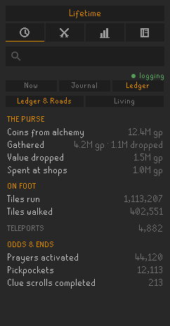
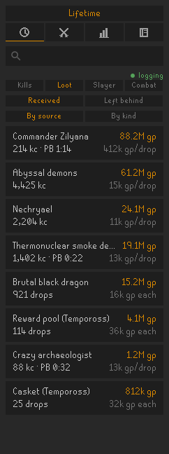
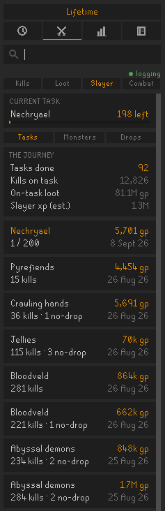
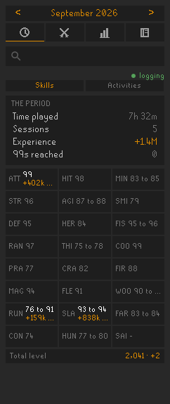
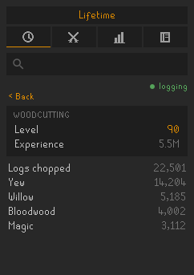
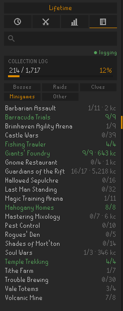
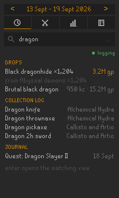

# Chronicle

This plugin creates a comprehensive log of your own account's progress.

Everything is kept on your own computer, as plain JSON under `.runelite/chronicle/`, and every figure the panel prints is worked out there from that file and the reference tables the plugin ships with.

## Using Chronicle

Chronicle is a side panel with four tabs. The row above them sets the period every board but Now reads, from the sitting you are in out to lifetime, and the search box underneath searches the whole record at once.

### Record

  
  
  

**Now** is your current gameplay session: the xp you gained, the drops you received and what they were worth, and whatever else the session actually produced. Only what you have triggered is shown, so a quiet session will be short and it will fill out over a longer grind. Your current slayer task sits at the top when you are on one, and the most recent drops along the bottom.

**Journal** is the dated feed. Every session, level, pet, collection log slot, quest, diary entry, combat achievement, death and what killed you, filed under day headings and filterable to one lens at a time.

**Ledger** is a count of the trackers that are neither kills, skills nor combat, over two boards. Ledger & Roads is the purse, the roads, teleports and a long tail of odds and ends. Living is what you ate and drank, and what it cost.

### PvM

  
  

**Kills** is the boss roster with your kill count against each.

**Loot** is every source and every item. Read it as received or as left behind, by source or by kind of item, with what each is worth and what it averages per drop. Personal bests sit on the sources that have one, and read by kind the whole board can be narrowed to what the slayer tasks paid.

**Slayer** keeps the current task on screen over three boards: the task-by-task journey with what each one paid and how many kills gave nothing, the game's own count per monster, and the drops the tasks produced.

**Combat** is a count of the trackers relating to combat: damage dealt, deaths, and your highest hit.

### Skilling

  
  

**Skills** shows the level and the experience each skill moved over the period as well as a summary of time played, sessions, experience and 99s reached. Opening a skill's cell will show that skill's own counters, such as logs chopped by tree or runes crafted by type.

**Activities** is the same count for minigames, clue scrolls, and the skilling grounds and creatures the log counts. The skilling bosses are counted with the rest on Kills.

### Collection log

  

In the collection log tab you can see the whole log split across the five tabs the in-game one presents, under your completion figure, with the slots held and the kill count where the log has given you one. Each line can be clicked on to show the drops inside. Opening the log in game records every page at once, not just the tab you clicked.

### Search

  

The box searches the record as you type: drops, collection log slots, journal lines, counters and kinds of item. Enter opens what the query names, or else the board the first results came from.

## Dependencies

Some functionality is gated behind two of RuneLite's built-in plugins, Slayer and Loot Tracker. Chronicle declares both, so RuneLite loads them alongside it. If you have either switched off, Chronicle says so at the top of the panel until you turn it back on.

**Slayer** enables the on-task tagging of kills, so that you can see your tasks and the slayer specific loot received.

**Loot Tracker** is how chest, casket and every other non-NPC pickup reaches Chronicle, and its archive is inherited on first run, so a late install starts with the drops already on your disk rather than empty.

## Sync

There is a sync option under the Advanced settings. It is off by default; turned on, it sends a copy of your full journal to a server of your choice as you play. For those technically minded of you, you can use this for hosting the data on your own server and use it in whatever way you wish. One example could be a Discord bot to query the data.

## Licence

BSD 2-Clause, see [LICENSE](LICENSE). Not affiliated with Jagex or RuneLite.
