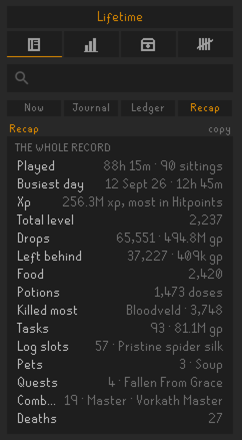
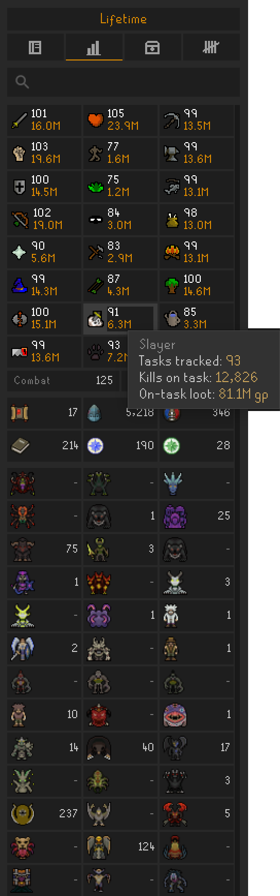
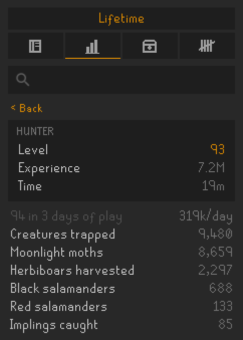
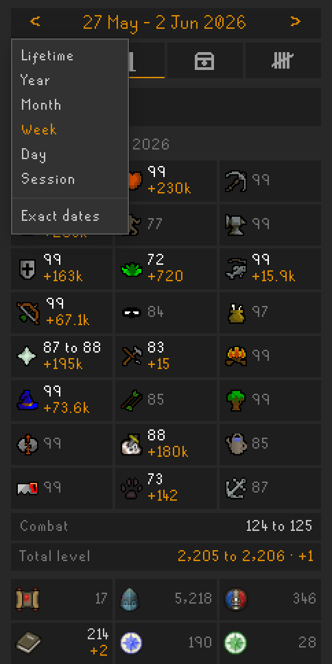
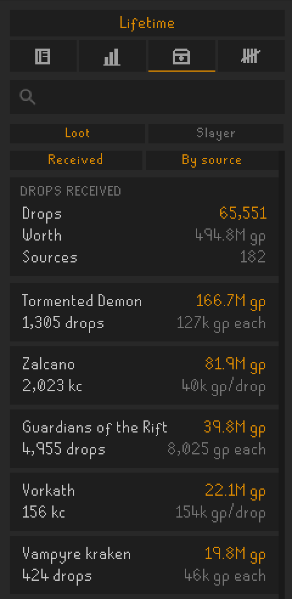
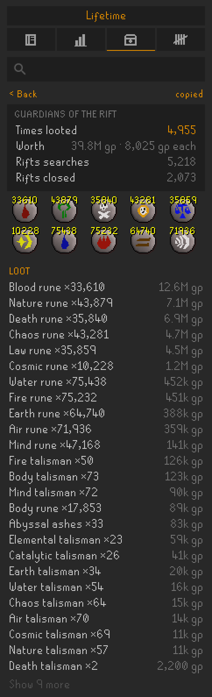
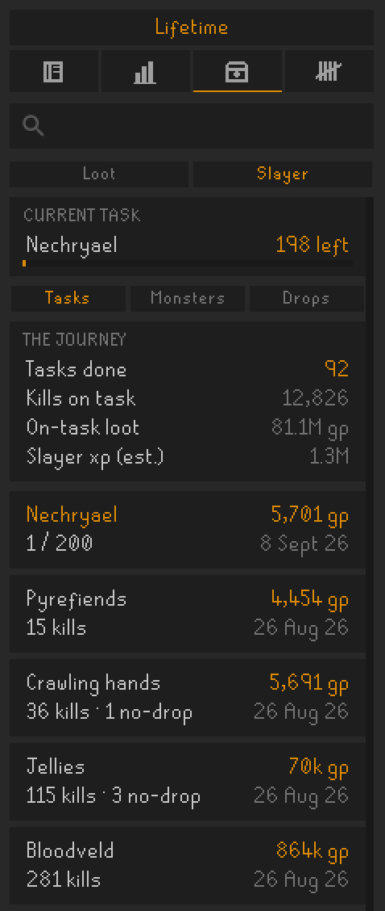
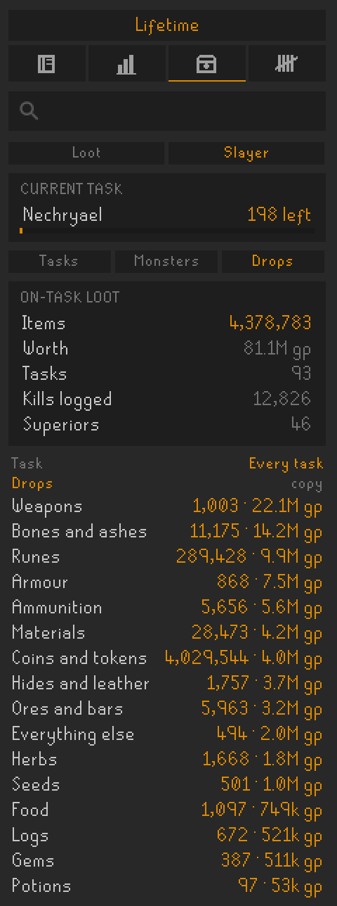

# Chronicle

This plugin creates a comprehensive log of your own account's progress.

Everything is kept on your own computer, as plain JSON under `.runelite/chronicle/`, and every figure the panel prints is worked out there from those files, the game and the reference tables the plugin ships with.

## Using Chronicle

Chronicle is a side panel with four tabs: Record, Standing, Loot and Trackers. The row above them sets the period the boards read, from the session you are in out to lifetime. Now always reads the session you are in. On every other board, click it to pick a year, a month, a week, a day or exact dates, and step back and forward with the arrows either side. The search box underneath searches the whole record at once.

Every board is live. A drop, a level, a kill or a clue counts towards what is on screen the moment it happens, on whichever board you are looking at, without opening anything or switching away and back.

### Record

  
  
  
  

**Now** is your current gameplay session: the xp you gained, the drops you received and what they were worth, and whatever else the session actually produced. Only what you have triggered is shown, so a quiet session will be short and it will fill out over a longer grind. Click the xp to see each skill and its xp per hour. Your slayer task sits at the top once you start killing it, and the most recent drops along the bottom.

**Journal** is the dated feed. Every session, level, pet, collection log slot, quest, diary entry, combat achievement, slayer task, clue, personal best, death and what killed you, filed under day headings and filterable to one lens at a time. Each day opens with its time played, xp and drops. The journal also marks milestones the game does not announce, such as 2,000 total level or 50M xp in a skill. Days written, on the journal's title card, opens a calendar of every day you have played.

**Ledger** is a count of the trackers that are neither kills, skills nor combat, over two boards. Ledger & Roads is the purse, the roads, teleports and a long tail of odds and ends. Living is what you ate and drank, and what it cost.

**Recap** is the period on one card: time played, xp, drops, what you ate and drank, what you killed most, slayer tasks, log slots, pets, quests, diaries, combat achievements and deaths. Each line opens its board. Copy puts the whole period on your clipboard as one large picture: every skill and boss from where the period found it to where it left it, the monsters you killed most, the loot, the trackers and what the period achieved.

### Standing

  
  
  

One sheet, in the order the game's own hiscores panel puts it: your skills, your combat and total level, the activities, then the bosses. A skill's cell shows its level and what the period moved it, and opens that skill's own page, with its pace and its counters, such as logs chopped by tree or runes crafted by type. A boss cell shows your kill count, and hovering any cell shows more. Over a shorter period the sheet shows what moved, and only the bosses you killed.

Your total level opens your records: longest session, biggest day, most kills in a day, richest day and highest hit.

The activity tiles are the way in to the rest of the account. Clues opens the tiers and what each one paid. Quests shows where each quest stands. Achievement diaries open by region, and your combat level opens the combat achievements by monster. Each task shows what it asks of you. Collections opens the whole collection log, or over a shorter period, the slots that period logged.

The collection log is the one the game shows, split across the same five tabs, under your completion figure, with the slots held and the kill count where the log has given one. Each page can be clicked to show every slot on it, held or missing, dated where known. Opening the log in game once records every slot on every page, and a page's kill count is recorded when you look at that page.

### Loot

  
  
  
  

**Loot** is every source and every item. Read it as received or left behind, by source or by item, with what each is worth. Received loot also reads by kind of item, and by kind it can be narrowed to what your slayer tasks paid. A source opens to its kill count, what it has paid per drop, your personal best and the day you set it, your average kill, the time you have spent there, and every item it has given. An item opens to when it first and last dropped, and where from. Either page can be copied as a picture.

**Slayer** keeps the current task on screen over three boards: the task-by-task journey with what each one paid and how many kills gave nothing, the game's own count per monster, and the drops the tasks produced. A task opens to the monsters you killed on it and what it paid, beside your usual and your best for that task.

### Trackers

Every counter the record keeps, filed by family. Combat is damage dealt and taken, your highest hits and your deaths, which open to what killed you. Skilling is what each skill has actually done, such as fish caught by type or laps run by course. Living and Ledger & Roads are the two boards the Ledger shows. The line under the families opens every counter on one page.

### Search

  

The box searches the whole record as you type: skills and pages to go to, bosses and monsters, slayer tasks, items, the collection log, quests, every combat achievement and diary task, trackers and every journal line. The best match comes first and Enter opens it, and a search that finds nothing offers the nearest name it knows.

## Dependencies

Some functionality is gated behind two of RuneLite's built-in plugins, Slayer and Loot Tracker. Chronicle declares both, so RuneLite loads them alongside it. If you have either switched off, a strip under the search box says so, and clicking it turns the plugin back on.

**Slayer** enables the on-task tagging of kills, so that you can see your tasks and the slayer specific loot received.

**Loot Tracker** is how chest, casket and every other non-NPC pickup reaches Chronicle, and its archive is inherited on first run, so a late install starts with the drops already on your disk rather than empty.

## Backups

The journal is plain files, so copying `.runelite/chronicle/` is the backup, and copying it back with RuneLite closed restores it. To add the journal from another computer, log in, tick Import a journal under the Advanced settings and choose the file. Importing the same file twice changes nothing.

## Sync

There is a sync option under the Advanced settings. It is off by default, and needs a server address and a token from that server. Turned on, it sends your own account's activity as you play: each drop, level, task and log slot as it happens, and your counters and levels every few minutes. Nothing is read back. For those technically minded of you, you can use this for hosting the data on your own server and use it in whatever way you wish. One example could be a Discord bot to query the data. The requests are in [ChronicleApiClient.java](src/main/java/chronicle/ChronicleApiClient.java), and the events they carry are built in [ChronicleEventCapture.java](src/main/java/chronicle/ChronicleEventCapture.java).

## Licence

BSD 2-Clause, see [LICENSE](LICENSE). Not affiliated with Jagex or RuneLite.
